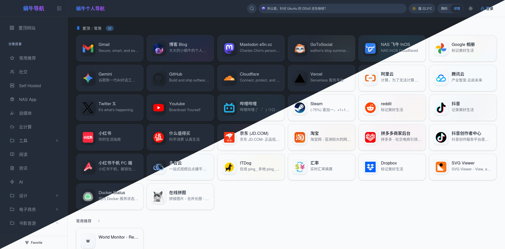

# F-Nav 个人导航

> [!NOTE]
> **本仓库是 [eallion/favorite](https://github.com/eallion/favorite)（蜗牛个人导航）的二次定制分支**，在保留原分类加密、私人书签、TOTP、多平台部署等能力的基础上，做了如下 UI / 性能定制：
>
> - **双卡片视图**：简约 = 正方形小图标卡片（80px 网格、一排标题、不展示描述）；详情 = 长方形横排卡片（图标 + 标题 + 描述）
> - **首屏加载**：居中圆形 spinner + "Nav" 文字，加载完成后淡出
> - **右下角回到顶部按钮**
> - **抓取描述按钮**：创建/编辑链接时一键读取目标页 `<title>` 与 `<meta name="description">` 自动填充描述（无需 AI）
> - **移动端安全区适配**：viewport `viewport-fit=cover` + `dvh` 视口，修复 iOS Safari 弹窗留白/贴边
> - **性能优化**：lucide-react 显式按需引入（首屏图标 chunk 由 ~560KB 降至 ~30KB）、LinkCard `React.memo`
>
> 原项目：[eallion/favorite](https://github.com/eallion/favorite)

> [!NOTE]
> **基于 EdgeOne Pages 开发。对 Cloudflare Pages 和 Vercel 只进行过简单地测试。**

**一个现代化云端导航 / 书签管理页面。**



## ✨ 特性

- **全分类锚点页面**：所有分类同屏展示，侧边栏一键跳转
- **前端可视化编辑**：右键菜单 / 拖拽排序 / 批量操作 / 分类管理
- **访客模式**：普通用户可正常浏览，登录后获得管理权限
- **KV 按分类存储**：链接按 `links:{category_id}` 拆分存储，读取时自动聚合
- **多平台部署**：EdgeOne Pages / Cloudflare Pages / Vercel 一键部署
- **KV 云端存储**：数据持久化，localStorage 缓存 + KV 双向同步
- **图标缓存**：可抓取网站图标并缓存到 EdgeOne Pages Blob / Cloudflare R2
- **AI 辅助**：集成 Gemini / OpenAI 兼容 API，自动填充链接描述、智能分类建议
- **数据导入导出**：Chrome 书签 HTML / JSON 备份 / WebDAV 云同步
- **丰富小组件**：Mastodon / Memos 动态滚动条、实时天气（和风天气）
- **个性化**：深色/浅色模式（自动检测系统偏好）、简约正方形小卡片 / 详情长方形卡片双视图、自定义图标
- **卡片动效**：从标题生成主色调作为图标底色，hover 高亮
- **加载动画**：首屏居中 spinner + "Nav" 文字，加载完成淡出；卡片淡入
- **回到顶部**：长页面右下角悬浮回到顶部按钮
- **TOTP功能**：使用流程开启：设置 → 两步验证 → 点“开启两步验证”→ 显示 Base32 密钥（可一键复制）→ 在验证器 App 手动添加账户粘贴密钥 → 输入 App 上的 6 位码 → 确认开启 → 显示恢复码（仅此一次，务必保存）
（登录：输入密码 + 动态验证码，两个都对了才发 Token（单设备机制不变）
应急：手机丢失时用恢复码登录——一次性有效，使用后 TOTP 自动关闭，可重新设置
设计要点
防锁死：恢复码机制保证换手机/删 App 不会永久锁死；万一恢复码也丢了，还能去 EdgeOne KV 控制台手动删除 totp_secret、totp_recovery 两个键
两步确认：密钥先生成为 pending，输入正确动态码才激活，防止“生成了密钥但验证器没存上”导致锁死
时钟容差：允许 ±30 秒偏差，避免手机时间稍不准就验证失败
无新增依赖（纯 Web Crypto 实现），构建体积几乎不变
部署提醒
functions/api/ 是 EdgeOne 的边缘函数，必须随本次一起部署，否则前端的“开启”按钮会报错。部署后完整测试一遍：开启 → 退出登录 → 用密码+动态码登录 → 再用恢复码登录验证应急通道。）
  
## 🧩 浏览器插件

你可以配合 **Chrome** /  **Firefox** 浏览器插件来快速添加书签：

- [eallion/chrome-extension-favorite](https://github.com/eallion/chrome-extension-favorite)
- [eallion/firefox-extension-favorite](https://github.com/eallion/firefox-extension-favorite)

[](https://chromewebstore.google.com/detail/nepjakfedadjkpjpideoaobngonilmoi) [](https://addons.mozilla.org/zh-CN/firefox/addon/favorite-assistant/)

## 🏗️ 技术架构

#### 技术栈

- React 19
- TypeScript
- Vite
- Tailwind CSS 4

#### Serverless / Storage

- **EdgeOne Pages**: Edge Functions + EdgeOne KV
- **Cloudflare Pages**: Pages Functions + Cloudflare KV
- **Vercel**: Vercel Functions + Vercel KV (Upstash Redis)

```
┌──────────────────────────────────────────────┐
│               Browser (Client)               │
│                                              │
│  React 19 + TypeScript + Tailwind CSS 4      │
│  State: Context + useReducer                 │
│  DnD: @dnd-kit                               │
│  Icons: lucide-react                         │
│                                              │
│  Data: localStorage (cache) + KV (persist)   │
└──────────────────┬───────────────────────────┘
                   │ HTTP API
┌──────────────────┴───────────────────────────┐
│     EdgeOne / Cloudflare / Vercel Backend    │
│                                              │
│  KV 存储：links:{category_id} 按分类拆分     │
│  认证：安全随机 Token + 自动清理旧 Token     │
│  平台适配：多平台 KV 接口抽象（屏蔽底层差异）│
└──────────────────────────────────────────────┘
```

## 🚀 部署指南

### EdgeOne Pages (推荐)

1. Fork 或克隆本仓库。
2. 在 EdgeOne 控制台创建 Pages 项目。
3. 构建设置：
   - 框架预设：`Vite`
   - 输出目录：`./dist`
   - 安装命令：`pnpm install`
   - 编译命令：`pnpm build`
4. 绑定 KV：创建 KV 命名空间，变量名称设为 `CLOUDNAV_KV`。
5. 环境变量：设置 `PASSWORD`（管理密码）；如需跨源访问（本地开发、备用域名等），设置 `ALLOWED_ORIGIN`，值需带协议（如 `https://sq.y11.fun`），多个用逗号分隔。
6. 自托管图标与缓存：
   - 本项目支持使用 **EdgeOne Pages Blob 存储** 实现网站图标缓存及自定义上传。
   - **无需手动配置/创建存储空间**，EdgeOne Pages Blob 由 SDK 首次调用时**自动创建**（命名空间归属于当前项目）。
   - 支持在控制面板的“图标自托管与缓存”中开启/关闭自动抓取缓存（免费用户若担心存储空间超限可以关闭该选项，关闭后仅服务已上传的自定义图标与实时抓取而不写入缓存）。

### Cloudflare Pages

1. 在 Cloudflare 控制台创建 Pages 项目，连接 GitHub 仓库。
2. 构建设置：
   - 框架预设选择 `Other`
   - 安装命令 `pnpm install`
   - 输出目录 `dist`。
3. 创建并绑定 KV：
   - 导航至 **Workers & Pages** -> **KV** -> **Create a namespace**。
   - 名字设为 `CLOUDNAV_KV`。
   - 回到 Pages 项目设置 -> **Settings** -> **Functions** -> **KV namespace bindings**。
   - 添加绑定：变量名称设为 `CLOUDNAV_KV`，选择刚才创建的命名空间。
4. 环境变量：
   - 在项目设置 -> **Environment variables** 中添加 `PASSWORD`（管理密码）。
   - 如需跨源访问，添加 `ALLOWED_ORIGIN`（带协议的完整 Origin，多个用逗号分隔）。
5. 自托管图标与缓存：
   - 本项目支持使用 **Cloudflare R2 对象存储** 实现网站图标缓存及自定义上传。
   - 导航至 **Workers & Pages** -> **R2** -> **Create bucket**，名字设为 `CLOUDNAV_R2`（或者您喜欢的名字）。
   - 回到 Pages 项目设置 -> **Settings** -> **Functions** -> **R2 bucket bindings**。
   - 添加 R2 绑定：变量名称设为 `CLOUDNAV_R2`，选择刚才创建的 R2 存储桶。
   - 设置环境变量 `UPLOAD_PLATFORM` 值为 `cloudflare`。
   - 支持在控制面板的“图标自托管与缓存”中开启/关闭自动抓取缓存（免费用户若担心存储空间超限可以关闭该选项，关闭后仅服务已上传的自定义图标与实时抓取而不写入缓存）。
6. 重新部署。

### Vercel

1. 在 Vercel 控制台导入 GitHub 仓库，框架预设选择 `Vite`。
2. 创建并连接 KV：
   - 在项目顶部菜单点击 **Storage** -> **Create Database** -> **Upstash for Redis**。
   - 创建成功后，点击 **Connect** 按钮将其绑定 to 本项目。
   - Vercel 会自动注入 `KV_URL` 等环境变量。
3. 环境变量：
   - 在项目 **Settings** -> **Environment Variables** 中手动添加 `PASSWORD`。
   - 如需跨源访问，添加 `ALLOWED_ORIGIN`（带协议的完整 Origin，多个用逗号分隔）。
4. 重新部署。

## ⚙️ 环境变量

| 变量 | 说明 | 必填 | 默认值 |
|------|------|------|--------|
| `PASSWORD` | 管理后台登录密码 | 是 | - |
| `ALLOWED_ORIGIN` | 跨源访问白名单，多个用逗号分隔，**必须带协议**（如 `https://sq.y11.fun`）。不填则仅允许同源访问 | 否 | 仅同源（无 `*` 兜底） |
| `UPLOAD_PLATFORM` | 上传与图标存储平台，部署到 Cloudflare 时可设为 `cloudflare` | 否 | - |

## 🔒 安全加固说明（2026-10 更新）

本仓库已按安全评估报告完成全量加固，部署后请注意以下行为变化：

- **管理操作需登录**：配置读写、WebDAV 云同步、备份恢复、图标上传/删除等接口强制认证（`Authorization: Bearer <token>`）；访客浏览（链接/分类/图标/搜索）保持匿名可用，不受影响。
- **敏感配置保护**：AI 配置段（`apiKey` 等）匿名不可读取——单值请求返回 401，批量请求自动剔除该段；仅登录管理员可见（纵深防御：即使鉴权被绕过也不会返回密钥）。
- **登录防护**：登录失败 5 次后按 IP 指数退避限流（最长 5 分钟）。
- **恢复码一次性使用**：恢复码登录后立即轮换，防止重放攻击。
- **SSRF 防护**：metadata 抓取与 WebDAV 代理仅允许 HTTPS 公网地址，逐跳校验跳转目标，禁止内网/私网地址；WebDAV 代理必须登录后使用。
- **安全响应头**：静态资源（`public/_headers`、`vercel.json`）与 API 统一响应均启用 CSP、HSTS、`X-Content-Type-Options`、`X-Frame-Options`、`Referrer-Policy`、`Permissions-Policy` 六项。
- **CORS 白名单**：默认仅同源放行，跨源需在 `ALLOWED_ORIGIN` 中精确声明（无 `*` 兜底），防止其他站点浏览器端偷偷读取 API。

> ⚠️ **部署提醒**：EdgeOne Pages 与 Vercel 部署后，如需跨源访问请设置 `ALLOWED_ORIGIN=https://<你的域名>`（值必须带协议，多个域名用逗号分隔，如 `https://s.a.com, https://another.example.com`）。若曾泄漏过管理密码或 AI Key，请立即吊销/修改并重新登录。

## 🛠️ 本地开发

```bash
# 安装依赖
pnpm install

# 1. 启动 Vite 开发服务器 (localhost:3000，仅前端)
pnpm dev

# 2. 模拟 EdgeOne 环境 (需安装 edgeone cli)
edgeone pages link
edgeone pages dev

# 3. 模拟 Cloudflare 环境 (需安装 wrangler)
pnpm build
wrangler pages dev ./dist --kv CLOUDNAV_KV

# 4. 模拟 Vercel 环境 (需安装 vercel cli)
# 需要先运行 vercel env pull .env.local 拉取云端 KV 变量
vercel dev
```

### 数据存储说明

- **KV Key 结构**：链接按分类拆分存储，key 格式为 `links:{category_id}`。
- **本地模拟**：EdgeOne 使用 CLI 模拟 KV；Vercel 需连接云端测试 KV 或使用 `kvMock.ts`。
- **首次部署**：系统会使用 `types.ts` 中的 `INITIAL_LINKS` 作为初始演示数据。

## 📁 项目结构

```
├── api/                       # Vercel Serverless Functions (TypeScript)
├── functions/api/             # EdgeOne / Cloudflare Pages Functions (JavaScript)
├── components/                # 通用 UI 组件 (Modal, Toast, ErrorBoundary, 小组件等)
├── services/                  # 前端业务逻辑 (AI, 书签解析, 导出, WebDAV 等)
├── src/
│   ├── components/            # 核心业务组件 (layout, category, link)
│   ├── contexts/              # React Context 状态管理 (Auth, Links, Categories, Config)
│   ├── hooks/                 # 自定义 Hooks (Search, DragSort, DataSync)
│   ├── utils/                 # 工具函数 (Config, Security, ColorExtractor)
│   └── constants/             # 常量定义
├── public/                    # 静态资源
├── App.tsx                    # 应用入口
├── types.ts                   # 类型定义 & 初始数据
├── vercel.json                # Vercel 部署配置
├── edgeone.json               # EdgeOne Pages 配置
└── package.json               # 项目依赖
```

## Inspiration

- [CloudNav-abcd](https://github.com/aabacada/CloudNav-abcd)

## 📄 License

本项目采用 [GLWTPL License](https://github.com/me-shaon/GLWTPL) 开源。

```
GLWT（Good Luck With That，祝你好运）公共许可证
            版权所有© 除作者外的所有人

任何人都被允许复制、分发、修改、合并、销售、出版、再授权
或任何其它行为，但风险自负。

作者对这个项目中的代码的行为一无所知。
代码处于可用或不可用状态，没有第三种可能


                祝你好运公共许可证
            复制、分发和修改的条款和条件

  0. 只要你永远不要留下任何可以追踪到原作者的线索，
你就可以随心所欲地做任何事，因此，不能因此责怪或追究
原作者的责任。

在任何情况下，作者均不对因使用或与本软件有关的合同诉讼、
侵权或其他方式产生的任何索赔、损害或其他责任负责。

自求多福吧。
```
